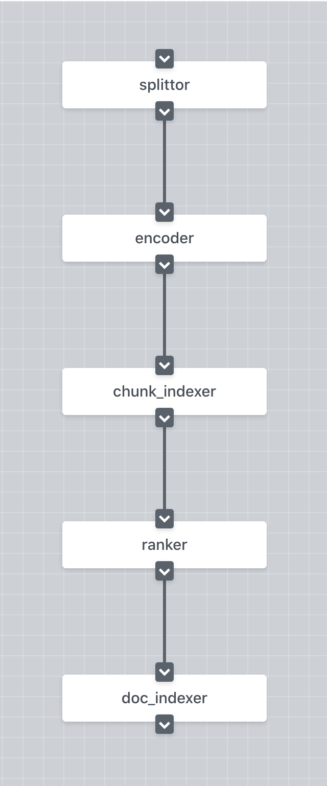

# urbandict-search

This demo shows how to use Jina to build a text search engine.

We use the [urban-dictionary-words-dataset](https://www.kaggle.com/therohk/urban-dictionary-words-dataset) as an example. The data contains 17 million entries from Urban Dictionary with definations and votes. 

In this demo, we use Jina to build a vocabulary search engine so that one can find a word if s/he only knows the definition. In the urbandict data, each word has one or more definitions. Here we consider each word with its definations as one **document**, and each defination as one **chunk**. If you are not familiar with these concepts, we highly suggest to go through our lovely [Jina 101](https://github.com/jina-ai/jina/tree/master/docs/chapters/101) and [Jina "Hello, World!"👋🌍](https://github.com/jina-ai/jina#jina-hello-world-) before moving forward. 

Some words have more than one definations from different users. In such cases, we use the ratio between upvotes and downvotes as the **weight of the chunks**.


## Overview
Before running into the codes, let's have an overview of the magic. The goal is to enable to find the word if you only know the defintion. To make this happen, we consider each sentence in the words' definition as a chunk, which is the minimal semantical unit in Jina. Specially, each word can be explained with a few sentences. And each sentence, as a chunk, is encoded into a vector.

Overall, we use multiple vectors to represent the definitions of each word. In the indexing time, we have both the words and their definitions from the urbandict data. Therefore, we encode the definitions of the words into vectors. During query, we only have the definition from the user's input. To retrieve the candidate words having the similiar definition, we follow the same magic and encode the user's input into vectors. We use the `robert` from the awesome **Transformers** library to encode the chunks.


## Prerequirements

This demo requires Python 3.7.

```bash
pip install -r requirements.txt
```


## Prepare the data

The raw urbandict data contains 2.5 million entries in the `.csv` format as following.

```
word_id,word,up_votes,down_votes,author,definition
0000007,Janky,296,255,dc397b2f,"Undesirable; less-than optimum."
```

Please download the `urban-dictionary-words-dataset.zip` from
[https://www.kaggle.com/therohk/urban-dictionary-words-dataset](https://www.kaggle.com/therohk/urban-dictionary-words-dataset) and saved at `/tmp`. 

After downloading, run the following script to do some data wrangling before indexing. We use the uncased words and drop the definitions with few up-votes. In total, 744,676 words are kept with 1,112,851 definitions. The processed data is kept in `/tmp/jina/urbandict/urbandict-word-defs.json`. 

```bash
python prepare_data.py
```


## Define the index flow
To index the data we use the the flow as below.

<table>
<tr>
<td> flow-index.yml</td>
<td> Flow in Dashboard</td>
</tr>
<tr>
<td>
  <sub>

```yaml
!Flow
pods:
  extractor:
    yaml_path: yaml/craft-extract.yml
    replicas: $REPLICAS
    read_only: true
  splittor:
    yaml_path: yaml/craft-split.yml
    replicas: $REPLICAS
    read_only: true
  encoder:
    yaml_path: yaml/encode.yml
    replicas: $REPLICAS
    timeout_ready: 60000
    read_only: true
  chunk_indexer:
    yaml_path: yaml/compound_chunk_indexer.yml
    replicas: $SHARDS
    seperated_workspace: true
  doc_indexer:
    yaml_path: yaml/index-doc.yml
    needs: extractor
  join_all:
    yaml_path: _merge
    needs: [doc_indexer, chunk_indexer]
    read_only: true
```

</sub>

</td>
<td>

</td>
</tr>
</table>


## Define the query flow

To index the data we use the the flow as below.

<table>
<tr>
<td> flow-query.yml</td>
<td> Flow in Dashboard</td>
</tr>
<tr>
<td>
  <sub>

```yaml
!Flow
with:
  read_only: true
pods:
  extractor:
    yaml_path: yaml/craft-extract.yml
    replicas: $REPLICAS
    read_only: true
  splittor:
    yaml_path: yaml/craft-split.yml
    replicas: $REPLICAS
    read_only: true
  encoder:
    yaml_path: yaml/encode.yml
    replicas: $REPLICAS
    timeout_ready: 60000
    read_only: true
  chunk_indexer:
    yaml_path: yaml/compound_chunk_indexer.yml
    replicas: $SHARDS
    seperated_workspace: true
  ranker:
    yaml_path: BM25Ranker
  doc_indexer:
    yaml_path: yaml/index-doc.yml

```

</sub>

</td>
<td>

</td>
</tr>
</table>


## Write the main function

explain the core part in the main function.


## Run Index

```bash
python app.py -t index
```


## Run Query

```bash
python app.py -t query
```

## Next Steps