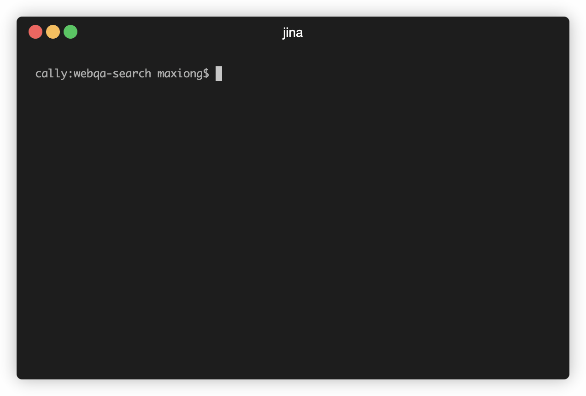

# JINA 100行代码搭建一套中文问答神经网络搜索引擎

    一提到搜索引擎，大家可能会想到实现**困难，系统复杂、臃肿**。但是现在有一个**魔法器**，**它可以让我们专注于业务本身，以最快的时间实现一套**神经网络搜索引擎。

    那这个魔法器是什么呢？它就是**jina**，那jina是什么呢？jina是一个**开源神经搜索引擎框架**，它有什么特点呢？**易上手**、**分布式**、**模型容器化**、**弹性扩展**和**云原生**。

    那么如何使用jina搭建一套搜索引擎呢？请看如下分解。

## 导读

- [效果展示](#效果展示)
- [总览](#总览)
- [环境依赖](#环境依赖)
- [数据预处理](#数据预处理)
- [定义Flow](#定义Flow)
- [运行Flow](#运行Flow)
- [小结](#小结)
- [深入Pod](#深入Pod)
- [回顾](#回顾)
- [结语](#结语)

## 效果展示



## 总览

    在继续阅读之前，如何你还没有阅读过[Jina 101](https://github.com/jina-ai/jina/tree/master/docs/chapters/101)，在继续阅读之前，我们强烈建议你先阅读[Jina 101](https://github.com/jina-ai/jina/tree/master/docs/chapters/101)。

    在本篇文章中我们将介绍如何使用jina搭建一套中文问答搜索引擎。通过本文，你将会学到：

1. Chunk是最基本的信息单元，Document是jina的最终输入和输出。

2. 在jina中如何定义Flow？

3. 在jina中如何定义Pod？

## 环境依赖

    这个demo运行在Python3.7以上的环境

```shell
pip install -r requirements.txt
```

## 数据预处理

    在这个系统中，我们采用WebQA作为我们的数据集。数据集含有410万个预先过滤过的、高质量问题和多个回复，数据集下载[地址](https://drive.google.com/open?id=1u2yW_XohbYL2YAK6Bzc5XrngHstQTf0v)。

    在下载好数据集以后，我们将数据集放到`/tmp`文件夹中，运行下面命令。

```shell
python prepare_data.py
```

    该数据集中每个条目对应一个问题和一个答案，每个问题包含多个答案。在数据预处理时，我们将同一个问题对应的答案进行聚合，整理为一问多答的形式。

## 定义Flow

    与传统的搜索引擎一样，jina也将搜索分为创建索引和查询两个任务，对应索引和查询两个不同的Flow。

### 创建索引

    在创建索引时，我们需要通过YAML文件定义Flow。在Flow中我们定义了`extractor`，`doc_indexer`, `encoder`, `chunk_indexer`, `join`5个Pod。

<table style="margin-left:auto;margin-right:auto;">
<tr>
<td> flow-index.yml</td>
<td> Flow in Dashboard</td>
</tr>
<tr>
<td>
  <sub>

```yaml
!Flow
pods:
  doc_indexer:
    yaml_path: doc_indexer.yml

  extractor:
    yaml_path: extractor.yml
    needs: gateway

  encoder:
    yaml_path: encoder.yml
    timeout_ready: 60000

  chunk_indexer:
    yaml_path: chunk_indexer.yml

  join:
    yaml_path: _merger
    needs: [doc_indexer, chunk_indexer]
```

</sub>

</td>
<td>

</td>
</tr>
</table>

> extractor

    将Document级别信息转换为Chunk级别的信息。

> encoder

    将Chunk中的文本编码成向量。

> chunk_indexer

    存储编码后的向量，还存储Chunk与Document的关联关系。

> join

    合并两条并行流程中的所有信息。在我们的例子中，join后面没有其他的Pod，所以join的功能类似于多线程编程中的等待并行线程全部完成。

> doc_indexer

    存储Document的原数据。

   介绍完各个Pod的作用，接下来，我们具体看看每个Pod如何定义的。

    我们通过`yaml_path`指定Pod的YAML文件地址。Flow中的信息传递默认是按照YAML文件中定义的顺序自上而下依次执行的。在特殊情况下，我们也通过`needs`指定接受哪个Pod的请求。例如在`extractor`这个Pod中，我们定义Pod的YAML文件地址为`extractor.yml`，接受来自`gateway`的请求，而不是上方的`doc_indexer`。

```yaml
extractor:
    yaml_path: extractor.yml
    needs: gateway
```

    两个Pod在YAML文件中的顺序是依次的，则不需要定义`needs`，例如在`chunk_indexer`这个Pod。

```yaml
chunk_indexer:
    yaml_path: chunk_indexer.yml
```

    如果一个Pod加载耗时很长，而在jina中Pod的默认加载时间为5s，我们则需要指定`timeout_ready`。例如在`encoder`这个Pod，我们指定它的加载时间为60s。

```yaml
encoder:
  yaml_path: encode.yml
  timeout_ready: 60000
```

    在这里你可能会发现还存在`gateway`这个Pod。这个Pod的主要作用是接受外部的请求，并将请求的数据发送到Flow中的Pod。在运行时，jina会自动在Flow的开头定义这个Pod，所以不需要在Flow的YAML文件中定义`gateway`。

### 查询

    当索引建立完成以后，下一步我们使用建立的索引进行查询。

    同样，在查询时，我们也利用YAML文件定义查询任务的Flow。在查询任务的Flow中，我们共用了在创建索引时定义的`extractor`、`encoder`、`chunk_indexer`和`doc_indexer`这几个Pod。它们在查询时的功能如下。

> extractor

将Document级别的信息转换为Chunk级别的信息。

> encoder

将Chunk中文本编码成向量。

> chunk_indexer

利用存储的Chunk索引，召回相似的Chunk。

> doc_indexer

利用存储的Document索引，召回相似的Document。

<table style="margin-left:auto;margin-right:auto;">
<tr>
<td> flow-query.yml</td>
<td> Flow in Dashboard</td>
</tr>
<tr>
<td>
  <sub>

```yaml
!Flow
pods:
  extractor:
    yaml_path: extractor.yml

  encoder:
    yaml_path: encoder.yml
    timeout_ready: 60000

  chunk_indexer:
    yaml_path: chunk_indexer.yml

  ranker:
    yaml_path: ranker.yml

  doc_indexer:
    yaml_path: doc_indexer.yml
```

</sub>

</td>
<td>

</td>
</tr>
</table>

    

    我们可以看到在查询任务中这些Pod的功能和在索引任务中是共用了相同的YAML文件进行定义的。我们如何控制Pod用同一个YAML定义文件实现不同的任务呢？只需要在Pod的YAML文件中定义不同任务请求下的处理逻辑。我们在后面会细细道来。

    相比索引任务，查询任务的Flow中还多了`ranker`这个Pod。`ranker`的作用是对Document下所有查询Chunk的查询结果进行打分排序，并将Chunk级别的信息转换为Document级别的信息。

## 运行Flow

### 创建索引

```python
python app.py -t index
```

<details>
<summary>点击查看日志输出</summary>

<p align="center">
  
</p>

</details>

    现在我们可以通过代码让这个Flow跑起来了。在创建索引的过程中，我们通过`flow-index.yml`定义索引任务的Flow。在这之后，我们需要通过`build()`让Flow中的Pod彼此连接，然后通过`index()`函数对数据进行索引。

```python
flow = Flow().load_config('flow-index.yml')
with flow.build() as fl:
    fl.index(raw_bytes=read_data(data_fn))
```

    在创建索引的过程中，我们将每个问题和问题下的所有回复当成一个Document，并以`bytes`的数据类型发送到Flow中。因为jina是一个支持各种不同模态内容的搜索引擎，所以各种数据都必须以`bytes`的形式发送。在这里我们为了节省时间，只创建50000条索引。

```python
def read_data(fn):
    with open(os.path.join(workspace_path, fn), 'r', encoding='utf-8') as f:
        items = json.load(f)

    result = []
    for _, value in items.items():
        result.append(("{}".format(json.dumps(value, ensure_ascii=False))).encode("utf-8"))

    for item in result[:50000]:
        yield item
```

### 查询

```python
python app.py -t query
```

<details>
<summary>点击查看日志输出</summary>

<p align="center">
  
</p>

</details>

    在查询时刻，我们同样从YAML文件中定义Flow。通过`search()`方法进行查询，查询的数据同样需要转换为bytes的数据类型。

```python
flow = Flow().load_config('flow-query.yml')
with flow.build() as fl:
    while True:
        title = input('请输入问题: ')
        item = {'title': title}
        if not title:
            break
        ppr = lambda x: print_topk(x)
        fl.search(read_query_data(item), callback=ppr, topk=top_k)
```

    在查询完成以后，FLow返回的数据形式为`Protobuf`，如果你希望了解详细的`Protobuf`内容，可以参考[链接](https://github.com/jina-ai/jina/blob/master/jina/proto/jina.proto)。`callback`参数接收一个函数，在接收到jina的返回结果后，会调用该函数对返回结果进行后处理。在这里，我们从返回结果中把得分最高的结果打印出来。`resp.search.docs`包含了所有的查询结果，对于每个查询结果得分最高的k个结果会保存在`topk_results`这个字段下。`raw_bytes`代表了Document的原数据。

```python
def print_topk(resp):
    print(f'以下是相似的问题:')
    for d in resp.search.docs:
        for tk in d.topk_results:
            item = json.loads(tk.match_doc.raw_bytes.decode('utf-8'))
            print('→%s' % item['title'])
```

## 小结

    在开始下面之前，我们回过头来看看，是不是觉得很简单。那你可能会问两条Flow有什么不同呢？

    第一个不同点，在创建索引时，我们采用了两条并行的处理流程。为什么要这样做呢？因为并行的处理流程可以提高创建索引的速度。为什么我们可以并行呢？因为在建立索引时，`doc_indexer`存储的是Document级别的索引；而`chunk_indexer`存储的是Chunk级别的索引；在`gateway`以后，彼此是独立的，没有信息的交互。

    第二个不同点，在创建索引时，Flow接收的请求类型为`IndexRequest`。更准确的说，`index()`方法本质是使用jina的Python客户端，向索引Flow发出一个`IndexRequest`类型的请求。在查询时，Flow中的请求类型为`SearchRequest`。这也是为什么我们在创建索引和查询任务中可以共用同一个Pod，因为我们在Pod的YAML文件中定义了不同请求下的处理逻辑。

## 深入Pod

    在阅读完上面之后，你意犹未尽，希望了解关于Pod的更多内容。请继续往下阅读。

    在jina中我们通过定义YAML文件来定义Flow，在[Jina 101](https://github.com/jina-ai/jina/tree/master/docs/chapters/101)中提到Pod也是通过YAML文件来进行定义的。那么是怎么定义的呢？我们继续往下走。

### doc_indexer

    在jina的原则中，一个YAML文件描述了一个对象的属性。所以我们可以通过YAML去改变对象的属性，而不必去改动代码。

    在`doc_indexer`中，它的作用是存储Document级别的原数据和查询Document级别的原数据。并且我们通过这样的定义方式`!BasePbIndexer`将jina自带的`BasePbIndexer`作为`doc_indexer`的Executor。

    我们通过定义`with`修改了`BasePbIndexer`中`__init__`方法中参数的值，在这里我们修改了存储索引文件的文件名。

```yaml
!BasePbIndexer
with:
  index_filename: doc_index.gzip

requests:
  on:
    IndexRequest:
      - !DocKVIndexDriver
        with:
          method: add

    SearchRequest:
      - !DocKVSearchDriver
        with:
          method: query

    ControlRequest:
      - !ControlReqDriver {}
```

    在`requests on`部分，我们分别定义了`IndexRequest`和`SearchRequest`下的处理逻辑。

    在`IndexRequest`请求时，`doc_indexer`调用`DocKVIndexDriver`进行索引存储。在一方面，因为Pod之间传递的数据类型为ProtoBuf。所以，Driver是一个数据类型转换器，将ProtoBuf转换为Python Object / Numpy Object，或将Python Object / Numpy Object转换尾ProtoBuf。在另一方面，`DocKVIndexDriver`调用了`BasePbIndexer`的`add()`存储了Document级别的数据，也就是存储了Document id和Document原数据。

    但是在`SearchRequest`时，`doc_indexer`调用`DocKVSearchDriver`查询了Document级别的索引。在DocKVSearchDriver中，DocKVSearchDriver调用了`BasePbIndexer`的`query()`方法，通过Document id索引Document的原数据。

### extractor

   在这个demo中，`extractor`主要任务有：

    1. 将Document级别的信息转换成Chunk级别的信息。

    2. 提取Document中的问题。

    在jina中我们可以在YAML文件中使用jina内部的Executor，也可以继承相应的基类来实现自己的Executor。在这里我们通过继承了`BaseSegmenter`实现了`WebQATitleExtractor`，`BaseSegmenter`的作用是将Document的信息转换为Chunk级别的信息；并且我们通过在`metas`中定义`py_modules`定义了`WebQATitleExtractor` py文件路径。

    与`doc_indexer`不同，`extractor`在`IndexRequest`和`SearchRequest`时都是相同的处理逻辑。

```yaml
!WebQATitleExtractor
metas:
  py_modules: extractor.py
requests:
  on:
    [IndexRequest, SearchRequest]:
      - !SegmentDriver
        with:
          method: craft
```

     在`WebQATitleExtractor`中我们通过复写`craft()`方法实现了`extractor`的主要任务。

```python
class WebQATitleExtractor(BaseSegmenter):
    def craft(self, doc_id, raw_bytes, *args, **kwargs):
        json_dict = json.loads(raw_bytes.decode('utf-8'))
        title = json_dict['title']
        return [{
                    'raw_bytes': title.encode('utf-8'),
                    'doc_id': doc_id,
                    'offset': 0,
                    'length': len(title),
                    'text': title
                }]
```

### encoder

    我们在`extractor`已经将问题从Document中提取了出来，那么我们下面需要做的是将问题编码成向量。

    在这里我们使用哈工大-科大讯飞的`Roberta base wwm ext`模型作为编码器模型。通过继承`BaseTextEncoder`实现了`TransformerRobertaEncoder`作为我们的编码器；并且使用`transformers`加载模型，使用`CLS`作为文本向量。我们通过定义`with`修改了`__init__`方法中参数的值。在这里我们修改了模型的路径，并将模型路径指向环境变量`ROBERTA_PATH`。详细代码见[链接]()。

```yaml
!TransformerRobertaEncoder
metas:
  py_modules: transformer_roberta.py

with:
  model_path: $ROBERTA_PATH

requests:
  on:
    [SearchRequest, IndexRequest]:
      - !EncodeDriver
        with:
          method: encode
```

### chunk_indexer

    `chunk_indexer`的YAML文件有点复杂。别着急，这是最简单的方法了。`chunk_indexer`中的Executor称为`ChunkIndexer`。它封装了另外两个Executor，`components`字段指定两个包装好的Executor，`NumpyIndexer`用于存储问题的向量，`BasePbIndexer`用作键值存储来存储Document id和Chunk id的关联。

```yaml
!ChunkIndexer
components:
  - !NumpyIndexer
    with:
      index_filename: vecidx_index.gzip
      metrix: cosine

  - !BasePbIndexer
    with:
      index_filename: chunk_index.gzip

requests:
  on:
    IndexRequest:
      - !VectorIndexDriver
        with:
          executor: NumpyIndexer
          method: add
      - !ChunkPruneDriver {}
      - !ChunkKVIndexDriver
        with:
          executor: BasePbIndexer
          method: add

    SearchRequest:
      - !VectorSearchDriver
        with:
          executor: NumpyIndexer
          method: query
      - !ChunkPruneDriver {}
      - !ChunkKVSearchDriver
        with:
          executor: BasePbIndexer
          method: query
```

    与`doc_indexer`一样，`chunk_indexer`在不同请求时，也有不同的处理逻辑。

    在`IndexRequest`时，我们定义了3个不同的Driver，`VectorIndexDriver`、`ChunkPruneDriver`和`ChunkKVIndexDriver`，3个Driver依次执行。在`VectorIndexDriver`时，我们调用了`NumpyIndexer`这个Executor中的`add()`存储了问题的向量。在存储完成以后，我们清除了Chunk中的某些数据，只保留Chunk id和Document id。因为在`ChunkKVIndexDriver`调用`BasePbIndexer`中的`add()`存储Document和Chunk的关联时，我们不需要这些数据，同时也是为了减少在网络传输时的数据大小。

    在`SearchRequest`时，我们同样定义了3个不同的Driver。`VectorSearchDriver`调用了`NumpyIndexer`中的`query()`索引了相似的Chunk，在这里我们使用了余弦相似度来进行召回。并且使用`ChunkPruneDriver`清除了Chunk中的某些数据，只保留Chunk id和Document id。因为我们在后面用不到这些数据，也是为了减少在网络传输时的数据大小。最后使用`ChunkKVSearchDriver`调用`BasePbIndexer`中的`query()`，索引出相似Chunk的Document id。

### ranker

    `ranker`只在查询任务时使用，所以我们只需要在YAML文件中定义`SearchRequest`的处理逻辑。

    在每个Document的每个查询Chunk都找到对应的相似Chunk以后，在这里我们只有一个查询Chunk，也就只有一个问题。下一步`ranker`利用`Chunk2DocScoreDriver`调用`MinRanker`中的`score()`方法对每个Document下所有Chunk的相似Chunk进行整体排序，排序方式以相似Chunk中的余弦距离进行升序排序。在排序完成以后，`score()`方法返回Document级别的信息。

```yaml
!MinRanker
requests:
  on:
    SearchRequest:
      - !Chunk2DocScoreDriver
        with:
          method: score
      - !DocPruneDriver
        with:
          pruned: chunks
```

### join

    在定义Flow时，我们提到`join`的作用是等待并合并两条并行流程的信息，并执行下面的任务。在指定`join`的`yaml_path`时，我们只需指定`yaml_path`为`_merge`，这样jina就会调用内部默认的`join` Pod的YAML文件。

```python
join:
    yaml_path: _merge
    needs: [chunk_indexer, doc_indexer]
```

## 回顾

    恭喜你，你已经了解了如何用jina搭建一套神经网络搜索引擎了👋👋。

    在你离开之前，我们来回顾下本篇文章中重要的知识点。

1. Chunk是jina的信息单元，Document是jina最终的输入和输出。

2. 在jina中，我们通过在YAML文件定义不同的Pod来定义Flow。

3. 在jina中，我们通过YAML文件来定义Pod。通过更改YAML文件来改变Pod的属性；并且可以在YAML文件中定义Pod在不同请求下的处理逻辑。

## 结语

    在这里你可能已经发现了Document中只有一个Chunk，那么如果有多个Chunk时，应该怎么做呢？请看下一篇，[JINA 3分钟实现一套新闻搜索系统]()。
