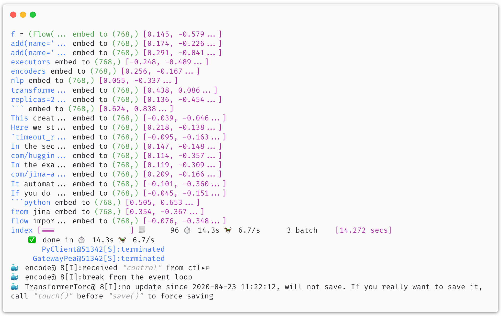

# From BERT-as-service to X-as-Service

[BERT-as-service](https://github.com/hanxiao/bert-as-service/) is a popular and scalable architecture for extracting feature vectors using BERT model. Unfortunately, it is optimized for the original BERT model only. Adaption is required if one wants to employ other deep learning models with such architecture.

In this short tutorial, we shall see how simple it is to use Jina for extracting feature vectors. The best part is, you can use any representation beyond BERT.

## Design the Flow 

Let's look at the workflow:

1. split the document by the punctuation, building a set of chunks from it;
2. use a deep learning model to embed sentences into vectors;
3. print the embedding in the console. 

In the real-world application, you may want to use one of our [`BaseIndexer` class](https://jina-ai.github.io/docs/api/jina.executors.indexers.html) to store these embeddings instead of printing them out. Please refer to other examples for the end-to-end workflow.

```python
from jina.flow import Flow

f = (Flow(callback_on_body=True)
     .add(name='spit', yaml_path='Sentencizer')
     .add(name='encode', image='jinaai/hub.executors.encoders.nlp.transformers-pytorch',
          replicas=2, timeout_ready=20000))
```

This creates a `Flow` with two `Pods`, corresponds to the first and second step described above. Here we start two `replicas`, so there will be two encoder running in parallel. `timeout_ready` is set to 20s (20000ms) as loading the pretrained model and starting pytorch take some time. 

In the second step, we use [transformers](https://github.com/huggingface/transformers) for embedding computation. In the example above, we use a prebuilt image from [Jina Hub](https://github.com/jina-ai/jina-hub). It automatically pulls the image to local when you run this flow. If you do not want to use Docker or if you already have transformer and pytorch installed locally, you can simply do:

```python
from jina.flow import Flow

f = (Flow(callback_on_body=True)
     .add(name='spit', yaml_path='Sentencizer')
     .add(name='encode', yaml_path='enc.yml',
          replicas=2, timeout_ready=20000))
```

with `enc.yml` such as 

```yaml
!TransformerTorchEncoder
with:
  pooling_strategy: cls
  model_name: distilbert-base-cased
  max_length: 96
```


## Implement the Input Function

Here we will simply feed this README file to the flow. Each line is considered as a document.

```python
def input_fn():
    with open('README.md') as fp:
        for v in fp:
            yield v.encode()
``` 

## Implement the Callback Function for the Output

Step 3 can be implemented by the callback function below.

```python
def print_embed(req):
    for d in req.docs:
        for c in d.chunks:
            embed = pb2array(c.embedding)
            text = colored(f'{c.text[:10]}...' if len(c.text) > 10 else c.text, 'blue')
            print(f'{text} embed to {embed.shape} [{embed[0]:.3f}, {embed[1]:.3f}...]')
```

## Run the Flow

```python
with f:
    f.index(input_fn, batch_size=32, callback=print_embed)
```



## Run the Encoding Work Remotely

Say if you don't have GPU resources locally and you want to deploy the encoding work to remote. You can simply start a gateway on the remote machine via:

```bash
jina gateway --allow-spawn --port-grpc 34567
```

Then you can change the local flow to:

```python
from jina.flow import Flow

f = (Flow(callback_on_body=True)
     .add(name='spit', yaml_path='Sentencizer')
     .add(name='encode', image='jinaai/hub.executors.encoders.nlp.transformers-pytorch',
          host='192.168.1.100', # the ip/hostname of the remote GPU machine
          port_grpc=34567,
          replicas=2, timeout_ready=20000))
```

Done!

For more information about running remotely and using Docker container, [please refer to our documentation](https://docs.jina.ai). 